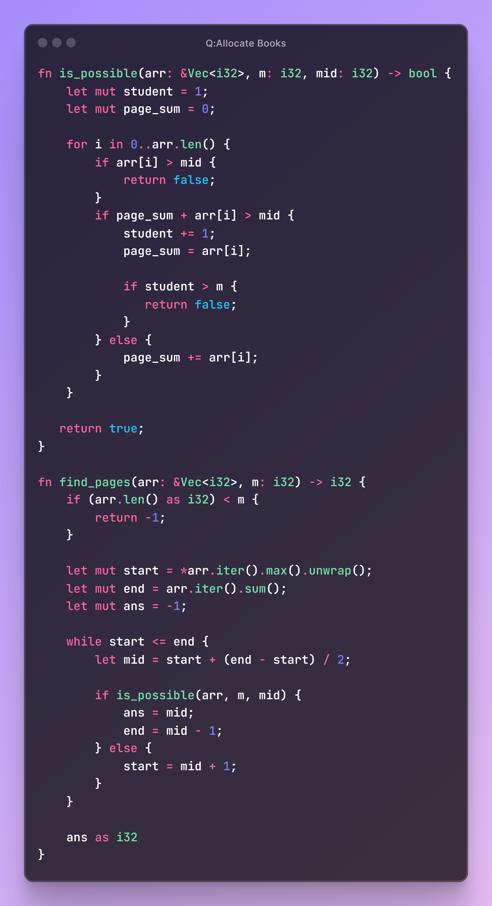

# DSA - 2

## Question

### Allocate Books

- [x] [Coding Ninja Problem](https://www.naukri.com/code360/problems/allocate-books_1090540)

---

## Code Block

```rust
fn is_possible(arr: &Vec<i32>, m: i32, mid: i32) -> bool {
    let mut student = 1;
    let mut page_sum = 0;

    for i in 0..arr.len() {
        if arr[i] > mid {
            return false;
        }
        if page_sum + arr[i] > mid {
            student += 1;
            page_sum = arr[i];

            if student > m {
               return false;
            }
        } else {
            page_sum += arr[i];
        }
    }

   return true;
}

fn find_pages(arr: &Vec<i32>, m: i32) -> i32 {
    if (arr.len() as i32) < m {
        return -1;
    }

    let mut start = *arr.iter().max().unwrap();
    let mut end = arr.iter().sum();
    let mut ans = -1;

    while start <= end {
        let mid = start + (end - start) / 2;

        if is_possible(arr, m, mid) {
            ans = mid;
            end = mid - 1;
        } else {
            start = mid + 1;
        }
    }

    ans as i32
}
```

```c++
bool isPossible(vector<int> &arr, int n, int m, int mid) {
  int student = 1;
  int pageSum = 0;

  for (int i = 0; i < n; i++) {
    if (mid < arr[i]) {
      return false;
    }
    if (pageSum + arr[i] > mid) {

      student++;
      pageSum = arr[i];

      if (student > m) {
        return false;
      }
    } else {
        pageSum += arr[i];
    }
  }
}

int findPages(vector<int> &arr, int n, int m) {

  if (n < m) {
    return -1;
  }

  int s = 0;
  int e = 0;
  int ans = -1;

  for (int i = 0; i < n; i++) {
    e += arr[i];
  }

  while (s <= e) {

    int mid = s + (e - s) / 2;

    if (isPossible(arr, n, m, mid)) {
      ans = mid;
      e = mid - 1;
    } else {
      s = mid + 1;
    }
  }
}
```

## Code Image


