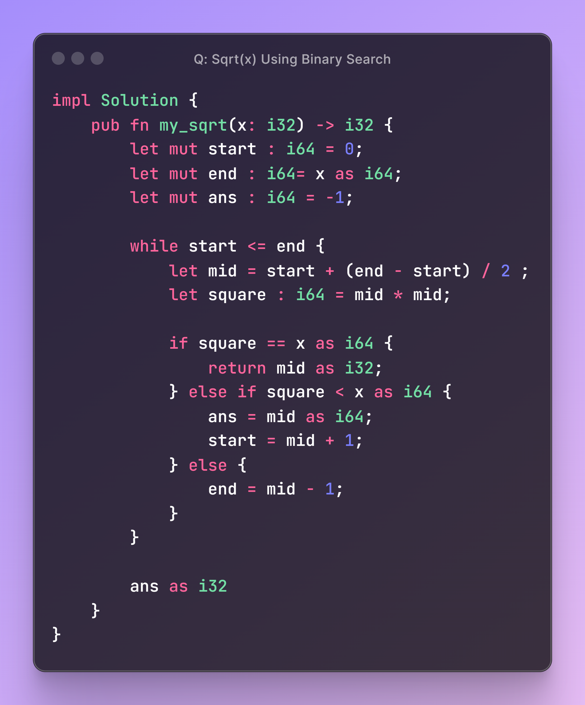

# DSA - 1

## Question

### Sqrt(x)

- [x] Given a non-negative integer x, return the square root of x rounded down to the nearest integer. The returned integer should be non-negative as well.
[LeetCode Problem](https://leetcode.com/problems/sqrtx/)

---

## Code Block

```rust
impl Solution {
    pub fn my_sqrt(x: i32) -> i32 {
        let mut start : i64 = 0;
        let mut end : i64= x as i64;
        let mut ans : i64 = -1;

        while start <= end {
            let mid = start + (end - start) / 2 ;
            let square : i64 = mid * mid;

            if square == x as i64 {
                return mid as i32;
            } else if square < x as i64 {
                ans = mid as i64;
                start = mid + 1;
            } else {
                end = mid - 1;
            }
        }

        ans as i32
    }
}
```

## Code Image


